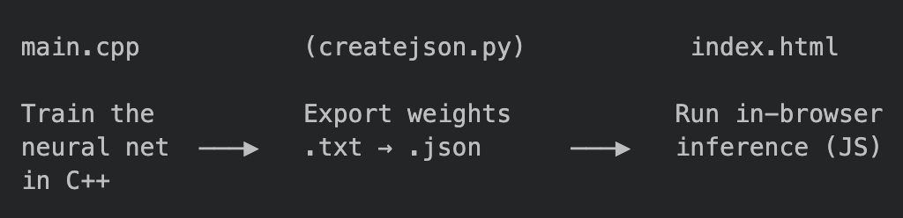
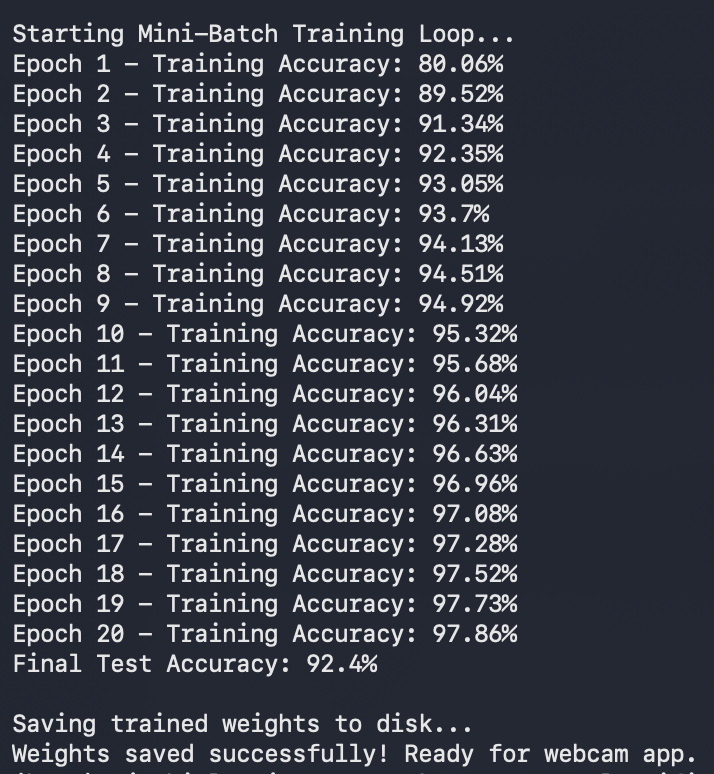

# MNIST Digit Classifier — From Scratch in C++
**Author:** Ojas Birla
**Date:** June 2026

A feedforward neural network for handwritten digit recognition, implemented entirely from scratch in C++ (no ML libraries - Matrix operations writen from scrach, forward/backward propagation, and Gradient Descent). The trained weights are exported to JSON and run client-side in the browser, where you can draw a digit and get a live prediction.

**[Try the live demo →](#)** *link*.\
[Read the full technical blog: How main.cpp works](blog-main-cpp.md)

-Ojas Birla

---

## How it works


<br><br/>

1. **`main.cpp`** trains a 2-layer neural network on MNIST using mini-batch gradient descent, implemented with a custom `Matrix` struct and manual backpropagation (no PyTorch, no NumPy).

2. **`createjson.py`** converts the trained weight/bias `.txt` files into a single `weights.json` for the web app.

3. **`index.html`** loads `weights.json` and runs the forward pass in plain JavaScript. You draw a digit on an HTML canvas, it gets centered and downsampled to 28×28, and the network predicts the digit live.

---

## Network architecture

| Layer | Shape | Activation |
|---|---|---|
| Input | 784 (28×28 flattened, normalized to [0,1]) | — |
| Hidden (L1) | 784 → 128 | ReLU |
| Output (L2) | 128 → 10 | Softmax |

 **Loss:** Cross-entropy (combined with softmax for a simplified gradient: `probs - target`)
-**Optimizer:** Mini-batch SGD

| Hyperparameters | Value |
|---|---|
| Training samples | 10,000 |
| Test samples | 2,000 |
| Batch size | 64 |
| Learning rate | 0.1 |
| Epochs | 20 |

---

## Project structure

```
.
├── main.cpp        
├── createjson.py   
├── index.html      
└── data/          
    ├── mnist_images.txt
    ├── mnist_labels.txt
    ├── mnist_test_images.txt
    ├── mnist_test_labels.txt
    ├── W1.txt
    ├── b1.txt
    ├── W2.txt
    └── b2.txt
```

---

## Getting started

### 1. Prepare the data

This project expects MNIST in **plain-text, space-separated** format (not the original IDX binary format):

- `mnist_images.txt` — each line is 784 space-separated pixel values (0–255)
- `mnist_labels.txt` — each line is a single integer label (0–9)
- Same for the `mnist_test_*` files

Place these inside a `./data/` folder alongside `main.cpp`. *(If you only have the original IDX files, you'll need a small conversion script to flatten them into this text format first.)*

### 2. Train the network

```bash
g++ -O3 -o train main.cpp
./train
```

Using -O3 is very impoartant as it makes the compiler use the hardware to its fullest limit. (Took 6 seconds with it and 1m 11s without for reading and first 10 epoches)

### This will:
- Load the training and test sets
- Run 20 epochs of mini-batch SGD, printing training accuracy per epoch
- Print final test accuracy
- Save trained weights to `./data/W1.txt`, `./data/b1.txt`, `./data/W2.txt`, `./data/b2.txt`

### Output: 



### 3. Export weights to JSON

```bash
pip install numpy
python createjson.py
```

This reads the four `.txt` weight files and writes `./web-page/weights.json`.

### 4. Run the web app

Serve the folder containing `index.html` and `weights.json` with any static file server (it won't work via `file://` due to the `fetch()` call):

```bash
cd web-page
python -m http.server 8000
```

Then open `http://localhost:8000` and draw a digit.

---

## How inference works in the browser

1. You draw on a 280×280 canvas.
2. On every stroke, the drawing is downsampled to 28×28 and binarized (pixel > 50 → 1, else 0).
3. The digit is **re-centered** using its center of mass (mirroring MNIST's own preprocessing), so it doesn't matter where on the canvas you draw.
4. The centered 28×28 grid is flattened into a 784-length vector and run through the same forward pass (`dot product → ReLU → dot product → softmax`) as the C++ training code, implemented in JS.
5. The predicted digit and confidence are displayed live.

A small debug canvas shows exactly what the network "sees" after centering — useful for checking that your strokes are being captured correctly.

---
